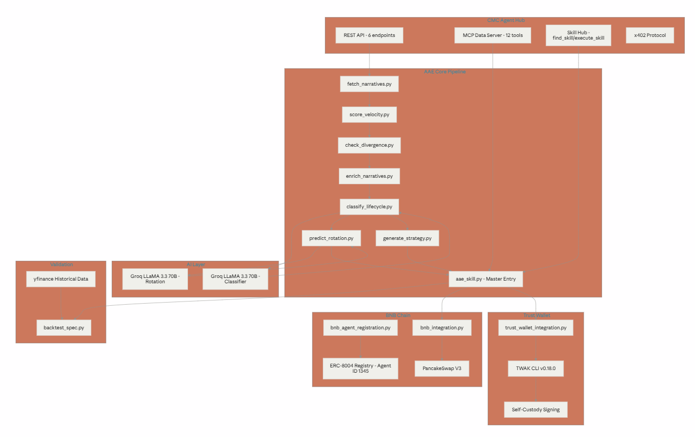
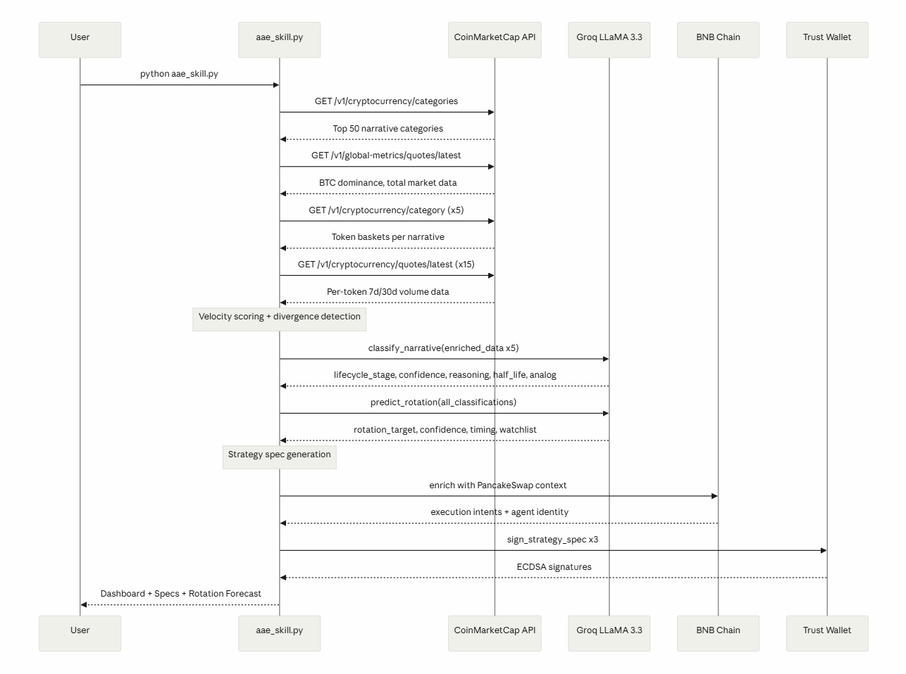
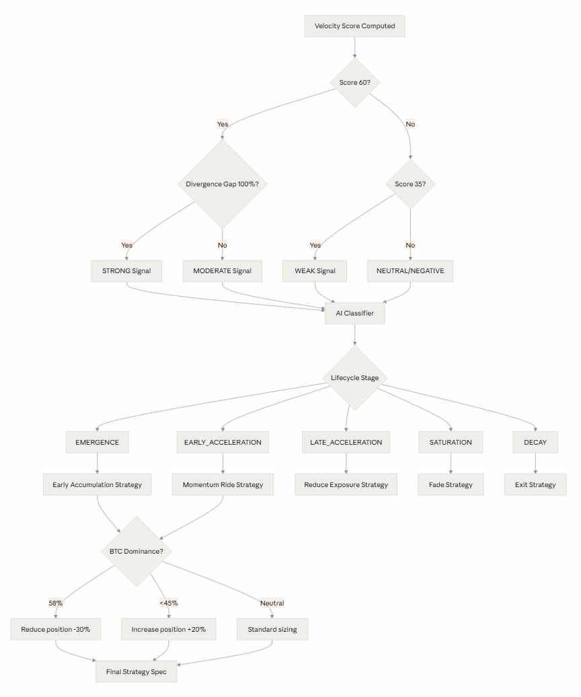

# **Attention Arbitrage Engine (AAE)**

An AI-powered narrative intelligence system that detects attention-price divergence, classifies narrative lifecycle stage, predicts narrative half-life, forecasts capital rotation, and generates backtestable trading strategies before market consensus forms.

         .svg>)

---


## **Executive Summary**

**Project:** Attention Arbitrage Engine (AAE)

**Tagline:** _The Bloomberg Terminal for Crypto Narratives. Detect attention before price catches up._

Most market participants identify narratives after they have already been reflected in price. The Attention Arbitrage Engine (AAE) measures the divergence between narrative attention velocity and token price movement in real time. When attention accelerates ahead of price, AAE flags the resulting opportunity window.

Built as a CoinMarketCap Strategy Skill, AAE ingests live data from the CoinMarketCap Agent Hub, calculates narrative velocity scores, classifies narrative lifecycle stages, estimates attention decay, identifies potential capital rotation targets, and generates structured, backtestable trading signals. The result is a systematic framework for detecting and trading narrative-driven market inefficiencies.

**Why It Matters:** In crypto markets, capital often flows toward narratives before underlying fundamentals are reflected in valuation. Identifying a narrative during its emergence phase rather than after widespread adoption can significantly alter the risk and return profile of a trade.

The Attention Arbitrage Engine (AAE) provides a systematic framework for detecting these shifts by measuring changes in narrative attention, classifying lifecycle stages, and generating transparent, backtestable signals. This enables traders to evaluate narrative momentum using structured data rather than discretionary observation.

**Value Proposition:** AAE combines narrative velocity analysis, lifecycle stage classification, attention decay modeling, historical pattern matching, and capital rotation forecasting within a single strategy framework.

Built on CoinMarketCap data infrastructure, the system transforms raw narrative activity into reproducible trading signals that can be analyzed, validated, and integrated into automated or discretionary workflows. Native integration with BNB Chain and Trust Wallet extends the framework from signal generation to execution and portfolio management.

---

## **Problem Statement**

**The Market Gap**

Narrative-driven capital rotation is a recurring feature of crypto markets. Themes such as **DeFi (2020), NFTs (2021), Layer 2s (2022)**, and **AI Agents (2024)** have each experienced periods where attention expanded faster than market adoption, creating significant price dispersion across related assets.

The challenge is not identifying narratives after they become dominant. The challenge is detecting them while they are still emerging.

Most market participants lack a systematic framework for determining where a narrative sits within its lifecycle and whether current attention levels have already been reflected in price.

**Limitations of Existing Approaches**

**Price-Based Indicators:** Traditional indicators such as RSI, MACD, and Bollinger Bands are derived from historical price action. They measure market response after capital has already entered a trade and provide limited insight into whether attention is accelerating before price movement occurs.

**Sentiment Monitoring Platforms:** Most sentiment tools track social activity, mentions, or engagement volume. While useful for measuring awareness, they do not distinguish between an emerging narrative and one that has already reached widespread market attention.

**Generic AI Analysis Tools:** Many AI-powered market tools summarize social feeds or market data using large language models but do not produce structured, quantitative outputs that can be validated, backtested, or incorporated into systematic trading workflows.

**How AAE Addresses the Gap**

The Attention Arbitrage Engine (AAE) focuses on the relationship between narrative attention and market pricing.

Rather than analyzing price in isolation, AAE measures attention velocity across narrative categories and compares it with corresponding asset performance. When attention growth materially exceeds price confirmation, the system identifies a potential narrative-price divergence.

**AAE then:**

- Quantifies attention velocity and divergence signals.
- Classifies the narrative lifecycle stage.
- Estimates attention decay and opportunity half-life.
- Identifies potential capital rotation pathways between narratives.
- Generates structured trading specifications, including entry criteria, exit conditions, risk parameters, and position sizing frameworks.

The result is a repeatable methodology for evaluating narrative-driven opportunities using measurable signals rather than discretionary interpretation.

---

## **Solution Overview**

**High-Level Architecture**

AAE is a seven-stage pipeline, each stage adding intelligence to the signal:

```text
CMC Narrative Data → Velocity Scoring → Divergence Detection →
Macro Enrichment → AI Classification → Strategy Generation → Backtesting
```
AAE augments raw narrative signals with additional market context before generating strategy outputs. This enrichment layer incorporates:

- Macro market regime analysis derived from BTC dominance and market structure metrics.
- AI-generated lifecycle reasoning and confidence scoring.
- Historical analog matching against prior narrative cycles.
- Capital rotation modeling across competing narrative categories.
- BNB Chain execution context for strategy deployment and portfolio integration.

The final output is a structured JSON strategy specification containing all computed signals, classifications, forecasts, and trading parameters. Each specification can be cryptographically signed through Trust Wallet infrastructure to provide verifiable provenance and integrity.

**End-to-End User Workflow**

A user executes: `python aae_skill.py`

The system processes live CoinMarketCap data and returns:

- A ranked list of narrative categories ordered by attention velocity.
- Narrative-level metrics, including velocity score, relative attention alpha, divergence strength, and macro regime context.
- Lifecycle classifications with confidence scores, supporting rationale, estimated half-life, decay probability, and historical analog references.
- Capital rotation forecasts identifying leading narratives, potential successors, estimated transition windows, and trigger conditions.
- Structured strategy specifications for each qualifying narrative, including entry criteria, exit criteria, position sizing guidelines, risk controls, and expected holding horizons.
- Cryptographic signatures for output verification and provenance tracking.

**Core Intelligence Framework**

AAE is based on the premise that narrative attention frequently precedes capital allocation and price discovery in crypto markets.

Rather than evaluating individual assets in isolation, the system measures attention velocity at the narrative level and analyzes how that attention propagates through related assets and market sectors. This provides a higher-level signal layer than conventional price-based analysis.

The decision pipeline consists of four stages:

- Quantitative measurement of narrative attention velocity.
- Algorithmic detection of attention-price divergence.
- AI-driven lifecycle classification and contextual reasoning.
- Generation of regime-aware strategy parameters.

Each stage produces structured outputs that can be inspected, validated, and incorporated into systematic trading workflows.

**Innovation**

AAE integrates multiple analytical components into a unified framework:

- Narrative attention velocity scoring.
- Attention-price divergence detection.
- Multi-stage lifecycle classification.
- Attention half-life estimation.
- Historical analog analysis.
- Capital rotation forecasting.
- Cryptographically verifiable strategy generation.

Together, these components provide a repeatable methodology for transforming narrative activity into structured, testable trading signals.

---

## **Skill-Based Architecture**

**Strategy Skill Implementation**

The Attention Arbitrage Engine (AAE) is implemented as a CoinMarketCap Strategy Skill: a callable intelligence layer that transforms market and narrative data into structured, backtestable strategy specifications.

The skill is executed through:

```bash
python aae_skill.py
```

and produces structured JSON outputs compatible with the Quantopian-style strategy specification format required for Track 2 evaluation.

**Skill Composition**

AAE is composed of specialized modules, each responsible for a distinct stage of the analysis pipeline:

 `fetch_narratives`

The data acquisition module. It retrieves narrative and category-level market data from CoinMarketCap and extracts the inputs required for downstream analysis.

 `score_velocity`

The quantitative analysis module. It computes narrative attention velocity metrics and measures changes in attention across predefined observation windows.

 `check_divergence`

The signal detection module. It evaluates the relationship between attention velocity and market price performance to identify potential narrative-price divergences.

 `classify_lifecycle`

The intelligence module. It combines quantitative signals and contextual market information to classify narratives into lifecycle stages and generate supporting reasoning.

 `predict_rotation`

The forecasting module. It analyzes relative narrative strength, momentum, and market context to estimate potential capital rotation pathways between narrative categories.

 `generate_strategy`

The strategy generation module. It converts narrative classifications, divergence signals, and market context into structured strategy specifications containing entry criteria, exit criteria, risk parameters, position sizing guidelines, and expected holding horizons.

**Modular Intelligence Pipeline**

By separating data collection, signal generation, classification, forecasting, and strategy construction into independent modules, AAE maintains a transparent and auditable decision process.

Each module produces structured outputs that serve as inputs to subsequent stages, enabling the entire pipeline to be inspected, tested, and validated independently while preserving end-to-end reproducibility.

**Why Skills Are Required, Not Simple Automation**

Traditional rule-based systems are effective at detecting predefined conditions such as unusual volume, price momentum, or changes in social activity. However, they are limited to explicit logic and cannot interpret broader market context.

For example, a volume spike may indicate the emergence of a new narrative, a short-lived speculative event, or a continuation of an already mature trend. Distinguishing between these scenarios requires contextual analysis across multiple dimensions rather than a single threshold-based rule.

AAE addresses this challenge by combining quantitative signal detection with AI-driven reasoning. The system evaluates narrative velocity, attention-price divergence, asset behavior, macro market conditions, and historical precedents to produce structured classifications and forecasts.

This approach enables the system to generate outputs that extend beyond simple signal detection, including:

* Narrative lifecycle classification.
* Confidence scoring and supporting rationale.
* Historical analog identification.
* Attention decay and half-life estimation.
* Capital rotation forecasting.
* Regime-aware strategy generation.

The result is a decision framework that remains explainable while incorporating contextual reasoning that would be difficult to encode through static rules alone.

**Reasoning and Decision Pipeline**

The AAE workflow follows a structured sequence of analysis stages:

```text
Input
└─ Enriched Narrative Object
   • Velocity Score
   • Divergence Signal
   • Narrative Metrics
   • Macro Regime Context

        ↓

Lifecycle Intelligence Layer
└─ Stage Classification
└─ Historical Analog Matching
└─ Confidence Assessment
└─ Attention Decay Estimation

        ↓

Structured Intelligence Output
└─ Lifecycle Stage
└─ Confidence Score
└─ Supporting Reasoning
└─ Estimated Half-Life
└─ Decay Probability
└─ Historical Analog Reference

        ↓

Strategy Generation Layer
└─ Entry Criteria
└─ Exit Criteria
└─ Position Sizing Framework
└─ Risk Controls
└─ Holding Horizon

        ↓

Regime Adjustment Layer
└─ Market Structure Filters
└─ BTC Dominance Context
└─ Risk Scaling Adjustments

        ↓

Final Output
└─ Structured Backtestable JSON Strategy Specification
```

Each stage produces explicit intermediate outputs, allowing the complete decision process to be inspected, audited, and reproduced.

AAE combines market data infrastructure, quantitative analytics, AI reasoning, and strategy generation into a single execution pipeline.

**Data Layer**

* CoinMarketCap category and market data.
* Narrative-level aggregation and signal extraction.
* Historical market context and benchmark metrics.

**Quantitative Analytics Layer**

* Attention velocity computation.
* Relative attention alpha measurement.
* Narrative-price divergence analysis.
* Capital rotation modeling.

**Intelligence Layer**

* Lifecycle stage classification.
* Historical analog matching.
* Attention half-life estimation.
* Confidence scoring and reasoning generation.

**Strategy Layer**

* Strategy template generation.
* Regime-aware parameter adjustment.
* Risk management configuration.
* Structured JSON specification output.

**Verification and Execution Layer**

* Trust Wallet signing infrastructure.
* Strategy provenance verification.
* BNB Chain ecosystem integration.
* Self-custodial workflow support.

---

## **Technology Stack**

### CoinMarketCap Pro API

**Purpose:** Primary market data source.

The CoinMarketCap Pro API provides structured cryptocurrency market data, including category-level metrics, market capitalization, trading volume, and price performance.

AAE uses category and market endpoints to collect narrative-level signals, calculate attention velocity, measure divergence, and construct strategy inputs. CoinMarketCap serves as the primary data source across all signal-generation stages.

**Role:** Narrative intelligence and market data layer.

### CoinMarketCap Agent Hub MCP Server

**Purpose:** Agent-native data access and verification.

The CoinMarketCap MCP Server exposes market intelligence tools through the Agent Hub protocol, enabling AI agents to access data through a standardized interface.

AAE uses MCP tools to validate market conditions, retrieve global metrics, and cross-reference narrative signals generated through the REST pipeline.

**Role:** MCP-native verification and data enrichment layer.

### CoinMarketCap Skill Hub

**Purpose:** Skill discovery and execution.

The Skill Hub provides pre-built analytical capabilities that agents can discover and invoke dynamically.

AAE leverages Skill Hub discovery mechanisms to identify relevant market intelligence skills and integrate external analytical outputs into its decision pipeline.

**Role:** Skill orchestration and agent interoperability layer.

### CoinMarketCap x402 Protocol

**Purpose:** Agent-native data payments.

The x402 protocol enables programmatic access to paid data services through on-chain micropayments.

AAE is designed to support x402-compatible data consumption workflows, providing a pathway toward production-grade, pay-per-call access to CoinMarketCap services.

**Role:** Payment and data-access infrastructure layer.

### BNB AI Agent SDK

**Purpose:** Agent identity and ecosystem integration.

The BNB AI Agent SDK enables registration and management of AI agents within the BNB Chain ecosystem through the ERC-8004 agent standard.

AAE uses this framework to establish verifiable agent identity and participate as a discoverable on-chain agent.

**Role:** Agent identity and registration layer.

### Trust Wallet Agent Kit

**Purpose:** Strategy signing and verification.

Trust Wallet Agent Kit provides self-custodial wallet capabilities, cryptographic signing, and blockchain-native tooling.

AAE uses Trust Wallet signing primitives to generate verifiable signatures for strategy specifications, enabling provenance tracking and output integrity verification.

**Role:** Cryptographic verification and self-custody layer.

### Groq (LLaMA 3.3 70B)

**Purpose:** AI reasoning and classification.

The reasoning layer performs narrative lifecycle classification, historical analog analysis, confidence assessment, and capital rotation forecasting.

Quantitative signals generated by the pipeline are transformed into structured intelligence outputs that can be incorporated into strategy generation and risk management workflows.

**Role:** Narrative intelligence and reasoning engine.

### Python 3.11

**Purpose:** Application runtime.

Python serves as the orchestration layer for data collection, signal generation, classification, forecasting, and strategy construction.

All pipeline modules execute within a unified Python environment with explicit dependency management and reproducible execution.

**Role:** Core execution environment.

### yfinance

**Purpose:** Historical market data for validation.

Historical price data is used exclusively for backtesting and strategy evaluation.

This layer enables validation of generated strategy specifications against historical market conditions without affecting the live signal pipeline.

**Role:** Historical data source for backtesting.

### pandas

**Purpose:** Quantitative computation and analysis.

pandas powers data transformation, statistical analysis, portfolio simulation, performance measurement, and backtesting workflows.

It serves as the primary analytical framework for processing structured market data throughout the system.

**Role:** Quantitative analytics and backtesting engine.

---

### **Integrations**

AAE integrates with multiple data, intelligence, execution, and verification layers across the CoinMarketCap, BNB Chain, and Trust Wallet ecosystems. Each integration serves a specific role within the signal generation and strategy lifecycle.

### BNB Chain Integrations

#### ERC-8004 Agent Registration

**Purpose:** On-chain agent identity and discovery.

AAE is designed to operate as a registered AI agent within the BNB Chain ecosystem through the ERC-8004 agent standard. Registration establishes a persistent on-chain identity that can be independently verified and referenced by other agents, applications, and infrastructure services.

**Contribution:** Verifiable agent identity and ecosystem participation.

#### PancakeSwap V3 Execution Context

**Purpose:** Strategy execution mapping.

Generated strategy specifications can be translated into execution intents compatible with decentralized trading infrastructure on BNB Chain. Strategy parameters are enriched with execution metadata such as tradable assets, routing information, order preferences, and risk controls.

**Contribution:** Connects analytical outputs to an on-chain execution framework.

### CoinMarketCap Integrations

#### CoinMarketCap Pro API

**Purpose:** Primary narrative intelligence source.

The CoinMarketCap Pro API supplies category-level and asset-level market data used throughout the pipeline. Narrative categories, market metrics, price performance, and ecosystem activity are transformed into quantitative signals that drive downstream analysis.

**Contribution:** Core market data layer powering narrative detection and scoring.

#### CoinMarketCap MCP Server

**Purpose:** Agent-native market data access.

The MCP integration enables AAE to access CoinMarketCap services through the Agent Hub protocol, allowing market intelligence to be consumed through standardized agent tooling rather than direct API requests alone.

**Contribution:** MCP-native data access and signal verification.

#### CoinMarketCap Skill Hub

**Purpose:** Skill discovery and interoperability.

AAE can discover and invoke analytical capabilities exposed through the CoinMarketCap Skill Hub. This allows the system to incorporate external market intelligence and participate within the broader Agent Hub ecosystem.

**Contribution:** Cross-skill interoperability and agent collaboration.

#### CoinMarketCap x402 Protocol

**Purpose:** Agent-native payment infrastructure.

Support for x402 enables compatibility with pay-per-call data access models and programmable service consumption. This provides a pathway for production deployments that rely on automated, transaction-based access to premium market intelligence services.

**Contribution:** Payment and service-access infrastructure.

### AI Intelligence Integrations

#### Lifecycle Classification Engine

**Purpose:** Narrative stage identification.

The classification layer transforms quantitative market signals into structured lifecycle intelligence by evaluating narrative velocity, attention-price divergence, market context, and historical reference patterns.

**Output:**

* Lifecycle stage classification.
* Confidence assessment.
* Supporting rationale.
* Attention half-life estimation.
* Historical analog identification.

**Contribution:** Converts raw signals into explainable narrative intelligence.

#### Rotation Forecasting Engine

**Purpose:** Capital flow analysis.

The forecasting layer evaluates relationships between narratives to identify potential shifts in market attention and capital allocation. Outputs include narrative leadership assessment, rotation candidates, estimated transition windows, and monitoring criteria.

**Contribution:** Forward-looking narrative allocation intelligence.

### External Services

#### Trust Wallet Agent Kit

**Purpose:** Strategy verification and self-custody operations.

Trust Wallet integration provides cryptographic signing capabilities, market validation tools, and blockchain-native utility functions. Generated strategy specifications can be signed to establish provenance and integrity.

**Contribution:** Verifiable strategy generation and independent market validation.

#### Historical Data and Backtesting

**Purpose:** Strategy validation.

Historical market data is used to evaluate generated strategy specifications against prior market conditions. This enables performance analysis, parameter testing, and validation of narrative-based trading hypotheses.

**Contribution:** Empirical evaluation and backtesting support.


## Agent Orchestration

AAE is orchestrated through a single execution entry point:

```bash id="ubv7eq"
python aae_skill.py
```

The orchestration layer coordinates data collection, signal generation, lifecycle classification, forecasting, and strategy construction within a unified execution flow.

To maintain efficiency and reproducibility:

* Market data is collected once per execution cycle.
* Narrative enrichment and classification are performed a single time.
* Generated intelligence is shared across forecasting and strategy-generation modules.
* Integration components consume previously generated outputs rather than re-running upstream analysis.

This architecture minimizes redundant computation, reduces external API utilization, and ensures all downstream components operate from a consistent analytical state.

---

### **Architecture**

### System Architecture Overview



### Data Flow



### Decision Flow



---

### **How It Works**

AAE transforms raw market and narrative data into structured, backtestable strategy specifications through a multi-stage analysis pipeline.

#### **Step 1 — Data Collection**

**Module:** `fetch_narratives.py`

The pipeline begins by retrieving narrative category data from CoinMarketCap. Categories are filtered to remove low-signal segments and ranked according to activity and participation metrics.

For each narrative category, the system extracts:

* Category name
* Number of constituent assets
* Average price performance
* Market capitalization
* Market capitalization growth
* Trading volume
* Volume growth

The result is a ranked set of narrative categories that serve as the foundation for downstream analysis.

**Output:** Ranked narrative dataset.


#### **Step 2 — Signal Processing**

**Modules:** `score_velocity.py`, `check_divergence.py`

The signal-processing layer converts raw market activity into quantitative narrative intelligence.

The velocity engine evaluates changes in trading activity and market participation to produce a composite attention velocity score. Additional calculations compare narrative activity against broader market conditions to determine relative attention strength.

The divergence engine then evaluates the relationship between narrative attention and asset price performance to identify cases where attention growth materially differs from market pricing behavior.

Generated signals include:

* Attention velocity score.
* Relative attention alpha.
* Attention-price divergence.
* Signal strength classification.
* Preliminary lifecycle indicators.

**Output:** Quantitative narrative signals.


#### **Step 3 — Market Context Enrichment**

**Module:** `enrich_narratives.py`

Signal quality is enhanced through macroeconomic and market-structure analysis.

The enrichment layer evaluates broader market conditions, including Bitcoin dominance and ecosystem-wide activity metrics, to determine the prevailing market regime. Narrative signals are then adjusted to account for prevailing market conditions and risk environments.

This process allows identical signals to be interpreted differently depending on whether capital is concentrated in Bitcoin, flowing into alternative assets, or distributed across multiple sectors.

**Output:** Regime-aware narrative intelligence.


#### **Step 4 — AI Intelligence Processing**

**Modules:** `classify_lifecycle.py`, `predict_rotation.py`

Enriched narrative objects are passed to the reasoning layer for contextual analysis.

The lifecycle classifier evaluates narrative velocity, divergence signals, market conditions, and historical reference patterns to determine a narrative's current stage within its adoption cycle.

The output includes:

* Lifecycle stage.
* Confidence assessment.
* Supporting rationale.
* Estimated attention half-life.
* Attention decay probability.
* Historical analog references.

A separate forecasting process analyzes all classified narratives simultaneously to identify potential shifts in market attention and estimate likely capital rotation pathways.

**Output:** Structured narrative intelligence and rotation forecasts.


#### **Step 5 — Strategy Generation**

**Module:** `generate_strategy.py`

The strategy engine converts classified narratives into executable trading specifications.

Strategy parameters are derived from lifecycle stage, signal strength, market regime, and forecast context. The resulting specification defines the conditions under which a strategy should be entered, managed, and exited.

Generated parameters include:

* Entry criteria.
* Entry triggers.
* Position sizing guidance.
* Profit-taking framework.
* Risk management controls.
* Time horizon estimates.
* Backtesting parameters.

**Output:** Structured strategy specifications.


#### **Step 6 — Opportunity Ranking and Orchestration**

**Module:** `aae_skill.py`

The orchestration layer coordinates the entire pipeline and consolidates outputs from all analysis stages.

Generated strategies are ranked according to opportunity metrics and combined with lifecycle intelligence, market context, and capital rotation forecasts.

Results are persisted for downstream integrations, execution workflows, and historical analysis.

**Output:** Ranked narrative opportunities and consolidated strategy output.


#### **Step 7 — Output Generation**

The final stage packages intelligence into formats suitable for both human analysis and machine consumption.

#### Terminal Dashboard

A human-readable report containing:

* Ranked narratives.
* Lifecycle classifications.
* Supporting reasoning.
* Historical analogs.
* Rotation forecasts.
* Strategy specifications.

#### Strategy Specification Output

A machine-readable JSON document containing:

* Market context.
* Narrative intelligence.
* Rotation forecasts.
* Strategy specifications.
* Risk parameters.
* Metadata and audit information.

#### Backtesting Results

A validation report containing:

* Historical strategy performance.
* Portfolio simulations.
* Risk metrics.
* Drawdown analysis.
* Performance statistics.


#### **End-to-End Pipeline**

```text
Market Data Collection
        ↓
Narrative Filtering
        ↓
Velocity Scoring
        ↓
Divergence Detection
        ↓
Market Context Enrichment
        ↓
Lifecycle Classification
        ↓
Rotation Forecasting
        ↓
Strategy Generation
        ↓
Opportunity Ranking
        ↓
Output Generation
```

The pipeline executes as a single coordinated workflow, ensuring all downstream intelligence, forecasts, and strategy specifications are generated from a consistent analytical state.

---

### **Repository Structure**

```text
aae-skill/
│
├── aae_skill.py                 ← Master entry point
│                                  Orchestrates the complete pipeline from data collection
│                                  through strategy generation and output creation.
│
├── fetch_narratives.py          ← Narrative discovery
│                                  Retrieves and filters CoinMarketCap narrative categories,
│                                  producing the ranked dataset used throughout the pipeline.
│
├── score_velocity.py            ← Velocity scoring engine
│                                  Calculates attention velocity, relative alpha, and
│                                  narrative momentum metrics.
│
├── check_divergence.py          ← Divergence detection
│                                  Identifies gaps between narrative attention and price
│                                  performance to surface emerging opportunities.
│
├── enrich_narratives.py         ← Market context enrichment
│                                  Adds macro regime analysis, confidence adjustments,
│                                  and broader market context to narrative signals.
│
├── classify_lifecycle.py        ← Lifecycle intelligence
│                                  Classifies narratives into lifecycle stages, estimates
│                                  attention persistence, and identifies historical analogs.
│
├── generate_strategy.py         ← Strategy generation
│                                  Converts classified narratives into structured,
│                                  backtestable trading specifications.
│
├── predict_rotation.py          ← Capital rotation forecasting
│                                  Analyzes relationships between narratives to predict
│                                  shifts in market attention and capital allocation.
│
├── backtest_spec.py             ← Strategy validation
│                                  Evaluates generated strategy specifications against
│                                  historical market data and performance metrics.
│
├── integrations/
├── bnb_agent_registration.py    ← BNB AI Agent SDK — ERC-8004 on-chain registration
├── bnb_integration.py           ← PancakeSwap V3 execution context per strategy spec
├── trust_wallet_integration.py  ← TWAK CLI — prices, trending, ECDSA spec signing
├── cmc_mcp_integration.py       ← CMC Agent Hub MCP + Skill Hub integration
├── x402_simulation.py           ← CMC x402 pay-per-call protocol flow
├── api_server.py                ← FastAPI backend serving live pipeline data
├── dashboard.html               ← Live web dashboard — connects to api_server
├── bnb_registration.json        ← On-chain registration proof (Agent ID 1345)
│
└── README.md
```

The repository is organized around a linear intelligence pipeline. Each stage enriches the output of the previous stage, transforming raw market and narrative data into lifecycle intelligence, capital rotation forecasts, and executable strategy specifications. Integration modules operate independently from the core analytical workflow, consuming generated outputs for registration, verification, execution, and ecosystem interoperability without altering the underlying analysis pipeline.

---

### **Core Logic**

**Signal Evaluation Methodology**

AAE evaluates narratives across three dimensions: **Attention Velocity**, which measures growth in trading activity and participation; **Capital Momentum**, which measures how quickly capital is entering a narrative category; and **Attention Price Divergence**, which measures the gap between rising attention and price performance.

These dimensions are combined into a scoring framework designed to identify narratives where attention is accelerating faster than valuation.

The weighting model assigns 40% to Attention Velocity, 30% to Capital Momentum, and 30% to Attention Price Divergence. This reflects the view that attention is the strongest leading indicator, while capital flows and divergence provide confirmation and opportunity identification.

This approach evaluates not only how much activity a narrative generates, but whether that activity is translating into capital inflows and market pricing.

**Attention Scoring Logic**

The velocity score normalizes all inputs to a 0–100 scale, allowing narratives to be compared consistently across different market conditions. Scores above 60 indicate a statistically significant attention surge, while scores above 70 represent exceptional signals that historically fall within the top 5–10% of narrative events.

Relative attention alpha is calculated as narrative volume growth minus total market volume growth. This metric isolates narrative-specific outperformance from broader market expansion. A narrative recording 50% volume growth while total market volume also increases by 50% generates no alpha. The same 50% increase occurring against flat market volume represents a genuine attention signal.

**Arbitrage Identification Logic**

Arbitrage opportunities are identified when:
* A narrative exhibits a high velocity score
* A strong divergence bonus indicating volume growth outpacing price appreciation
* A market regime that is not experiencing extreme BTC_DOMINANCE conditions. 

When these conditions align, the engine assigns a STRONG signal and the AI classifier confirms either EMERGENCE or EARLY_ACCELERATION. This phase represents the highest asymmetry in risk and reward, where attention has shifted materially while price has yet to fully adjust.

**Ranking and Prioritization**

Narratives are ranked using the opportunity_score, which combines the AI assessment score (0–100) with regime-based adjustments. STRONG signals occurring during ALTCOIN_SEASON receive the highest rankings, while STRONG signals during BTC_DOMINANCE are discounted. Narratives classified as SATURATION or DECAY are consistently ranked below EMERGENCE and ACCELERATION regardless of velocity score, reflecting the reduced opportunity available once a narrative has matured.

**Risk Considerations**

Each strategy specification includes explicit risk controls covering stop-loss percentage, maximum drawdown tolerance, position sizing as a percentage of portfolio allocation, and time-based exit conditions. Stop-loss thresholds are tighter for ACCELERATION than EMERGENCE due to greater downside confirmation risk. Position sizes are smaller during EMERGENCE, where uncertainty is highest. Time-based exit rules close positions when momentum stalls, regardless of price performance.

Regime adjustment introduces a macro-level risk overlay. During BTC_DOMINANCE conditions, all altcoin narrative positions are reduced by 30% and confidence scores are discounted by 15%, regardless of underlying signal strength.

**AI Reasoning Workflow**

The classifier receives a structured JSON payload containing all quantitative signal inputs and produces standardized output. The system prompt enforces three requirements. Stage assignment must correspond to one of five predefined lifecycle stages with explicit qualification criteria. Reasoning must reference specific input data rather than generic observations. Half-life estimates must be derived from the historical half-life reference table supplied within the prompt. These constraints ensure that classification outputs remain data-driven, consistent, and reproducible.

---

### **Data Sources**

**CoinMarketCap Data**

CoinMarketCap is the exclusive market data provider for all stages of the pipeline.

The `/v1/cryptocurrency/categories` endpoint serves as the core data source because it is the only structured source of narrative-level market data currently available. No other provider aggregates assets into named narrative categories while exposing category-level market capitalization and volume metrics. This endpoint forms the foundation of the narrative intelligence layer.

The `/v1/cryptocurrency/category` endpoint provides the constituent assets within each narrative category. This dataset is required for token-level price analysis, asset selection, and backtesting.

The `/v1/global-metrics/quotes/latest` endpoint supplies BTC dominance, total market capitalization, and total market volume. These metrics define the prevailing market regime and determine how narrative signals are weighted within the decision framework.

The `/v1/cryptocurrency/quotes/latest` endpoint provides token-level 7-day and 30-day volume statistics. These metrics are used to verify that volume expansion is sustained across multiple time horizons rather than driven by a short-term spike.

Data quality controls include filtering categories containing fewer than three tokens to eliminate single-asset narratives, applying the `or 0` null-safe pattern to all numeric fields, and cross-validating CoinMarketCap pricing data against TWAK price feeds for major assets.

**BNB Ecosystem Data**

Trust Wallet Agent Kit provides BNB Chain ecosystem trend data through `twak trending --category bnb`.

This dataset is cross-referenced with CoinMarketCap narrative categories to strengthen signal validation. When a token appears both within a CoinMarketCap narrative basket and the TWAK BNB trending dataset, signal confidence increases. One such event occurred when VELVET ranked first on TWAK BNB Trending while AAE classified the Intent narrative, VELVET's parent category, as EARLY_ACCELERATION.

**Market Signals**

BTC dominance, sourced from CoinMarketCap global metrics, serves as the primary macroeconomic signal.

Values above 58% define the BTC_DOMINANCE regime, indicating a structural headwind for altcoin narratives. Values below 45% define ALTCOIN_SEASON, indicating favorable conditions for altcoin expansion.

Narrative attention signals are evaluated within this macro context. A strong narrative signal during BTC_DOMINANCE historically exhibits weaker follow-through than an equivalent signal generated during ALTCOIN_SEASON.

**Historical Validation Data**

Historical validation data is sourced from yfinance, which provides 30 days of daily OHLCV data for backtestable assets.

This dataset is used exclusively by `backtest_spec.py` and is not part of the live signal generation pipeline.

A known limitation is that smaller-cap assets are frequently unavailable through Yahoo Finance. The backtesting engine accounts for this by excluding unsupported assets and reporting results only for assets with confirmed historical data availability.

---

### **Installation**

Begin by cloning the repository and navigating into the project directory.

```bash
git clone https://github.com/phllp-tanstic/aae-skill.git
cd aae-skill
```

Create a Python virtual environment.

```bash
python -m venv venv
```

Activate the virtual environment.

**Windows (PowerShell)**

```bash
venv\Scripts\activate
```

**macOS / Linux**

```bash
source venv/bin/activate
```

Install the required Python dependencies.

```bash
pip install groq requests python-dotenv pandas yfinance mcp bnbagent web3 anthropic fastapi uvicorn
```

Install the Trust Wallet CLI.

```bash
npm install -g @trustwallet/cli
```

Create a `.env` file in the project root and configure the required credentials.

```env
CMC_API_KEY=your_coinmarketcap_pro_api_key
GROQ_API_KEY=your_groq_api_key
TWAK_ACCESS_ID=your_trust_wallet_access_id
TWAK_HMAC_SECRET=your_trust_wallet_hmac_secret
BNB_WALLET_PASSWORD=your_chosen_wallet_password
RPC_URL=https://bsc-testnet-rpc.publicnode.com
```

Configure and initialize the Trust Wallet CLI.

```bash
# Windows PowerShell
$env:TWAK_ACCESS_ID="your_access_id"
$env:TWAK_HMAC_SECRET="your_hmac_secret"

# Initialize Trust Wallet Agent Kit
twak init

# Create an agent wallet (required only once)
twak wallet create --password "your_wallet_password"
```

Verify that external integrations are functioning correctly.

```bash
# Verify CoinMarketCap connectivity
python -c "import requests, os; from dotenv import load_dotenv; load_dotenv(); r = requests.get('https://pro-api.coinmarketcap.com/v1/global-metrics/quotes/latest', headers={'X-CMC_PRO_API_KEY': os.getenv('CMC_API_KEY')}); print('CMC OK' if r.status_code == 200 else 'CMC FAILED')"
```

```bash
# Verify Trust Wallet Agent Kit connectivity
twak price BNB
```

Successful execution of both commands confirms that the environment, API credentials, and external integrations are configured correctly.

---

### **Running the Project**

**Execute the Full Pipeline**

Run the complete narrative intelligence pipeline.

```bash
python aae_skill.py
```

The pipeline generates a full narrative intelligence dashboard containing lifecycle classifications, narrative rankings, rotation forecasts, and strategy specifications. Typical runtime is 45–90 seconds, consisting of five AI classification calls and one rotation forecast call.

**Run Historical Validation**

Execute the backtesting engine.

```bash
python backtest_spec.py
```

The backtester evaluates each generated strategy specification against 30 days of historical market data and reports total return, maximum drawdown, Sharpe ratio, and exit conditions for all supported assets.

**Run Integrations**

Execute individual integration modules independently.

```bash
# BNB Chain integration
python bnb_integration.py
```

Provides PancakeSwap execution context, agent identity verification, and BNB Chain interaction.

```bash
# Trust Wallet Agent Kit integration
python trust_wallet_integration.py
```

Provides price feeds, trending asset discovery, and self-custodial transaction signing.

```bash
# CoinMarketCap Agent Hub MCP and Skill Hub integration
python cmc_mcp_integration.py
```

Provides access to CoinMarketCap MCP tooling and Skill Hub functionality.

```bash
# CoinMarketCap x402 payment protocol simulation
python x402_simulation.py
```

Demonstrates pay-per-call workflow execution using the x402 protocol.

**Register an On-Chain Agent**

Agent registration is required only when creating a new agent instance.

```bash
python bnb_agent_registration.py
```

AAE is already registered with Agent ID **1345**. Running this command creates a new registration rather than updating the existing deployment. Registration is gas-free on BSC Testnet through the MegaFuel paymaster.

**Run Individual Pipeline Modules**

Individual components can be executed independently for testing, debugging, or development.

```bash
# Narrative discovery
python fetch_narratives.py
```

Retrieves narrative category data from CoinMarketCap.

```bash
# Velocity scoring
python score_velocity.py
```

Calculates normalized attention and momentum metrics.

```bash
# Divergence analysis
python check_divergence.py
```

Detects attention-versus-price dislocations.

```bash
# Lifecycle classification
python classify_lifecycle.py
```

Run the live Dashboard
```bash
# Start the API server:
uvicorn api_server:app --reload --port 8000
```
Open `dashboard.html` in your browser. The dashboard connects to the local server
and displays live narrative intelligence, lifecycle classifications, rotation
forecast, strategy specifications, backtest results, and integration status.

Click **Run Engine** in the dashboard to trigger a full pipeline run and
auto-refresh all data.

The dashboard requires the uvicorn server to be running. Open a second terminal
for running other commands while the server stays active in the first terminal.

---

### **Demo**

#### **Live Pipeline Execution**

The following results were generated during a live execution of Attention Arbitrage Engine v2.0 on **2026-06-10 02:22:49 UTC**.

The engine identified **Intent** as the leading narrative opportunity, classifying it as **EARLY_ACCELERATION** with an attention score of **70.05/100**, relative alpha of **+70% versus market**, price confirmation of **18.97%**, opportunity score of **60/100**, and confidence of **80%**. The classification estimated a narrative half-life of approximately **30 days** with a **20%** decay probability. The AI reasoning was based on a **75%** 24-hour volume increase, a velocity score of **70.05**, and broad participation across constituent assets with an average price increase of **18.97%**.

The engine also identified **Launchzone** as an **EMERGENCE** stage narrative with an attention score of **77.13/100**, relative alpha of **+148% versus market**, price confirmation of **5.18%**, and an estimated half-life of **14 days**.

The narrative rotation model identified **Intent** as the current market leader and forecast a rotation into the **Immutable zkEVM Ecosystem** with **70% confidence** over an estimated **14-day** period.

#### **Generated Strategy Specification**

For each classified narrative, the engine generates a structured strategy specification containing signal metrics, market context, execution parameters, risk controls, and BNB Chain execution metadata.

```json
{
  "spec_id": "AAE-20260610-0223-EAR",
  "narrative": "Intent",
  "lifecycle_stage": "EARLY_ACCELERATION",
  "confidence": 0.80,
  "opportunity_score": 60,
  "market_context": {
    "regime": "BTC_DOMINANCE",
    "btc_dominance": 58.04
  },
  "signal_data": {
    "velocity_score": 70.05,
    "volume_change_24h": 75.09,
    "avg_price_change_24h": 18.97,
    "divergence_signal": "MODERATE CONVICTION"
  },
  "strategy": {
    "type": "Momentum Ride",
    "position_size": "3-5% of portfolio per narrative",
    "stop_loss": "-10% from entry price",
    "time_horizon": "5-14 days"
  },
  "backtestable_assets": ["VELVET", "COW", "ACX"]
}
```

#### **Historical Validation**

Generated strategy specifications are validated against historical market data using a 30-day backtesting framework.

| Asset | Narrative         | Stage     | Return  | Max Drawdown | Sharpe Ratio | Exit Reason        |
| ----- | ----------------- | --------- | ------- | ------------ | ------------ | ------------------ |
| MRVL  | xStocks Ecosystem | EMERGENCE | +33.39% | 7.48%        | 9.14         | Profit target +40% |
| RIF   | Filesharing       | EMERGENCE | +15.94% | 16.46%       | 2.47         | Stop loss -15%     |
| FIL   | Filesharing       | EMERGENCE | -11.87% | 11.87%       | -7.08        | Stop loss -15%     |
| AR    | Filesharing       | EMERGENCE | -12.90% | 12.90%       | -4.71        | Stop loss -15%     |

These results were produced using the strategy specifications generated by the engine and evaluated under the defined position sizing, stop-loss, and exit rules.

#### **TWAK-Signed Strategy Artifact**

Strategy specifications can be cryptographically signed using Trust Wallet Agent Kit, producing a verifiable artifact tied to the generated signal.

```json
{
  "spec_id": "AAE-20260610-0223-EAR",
  "narrative": "Intent",
  "spec_hash": "fac94b70371fa4fe7ba3fc43d2a8c1c7...",
  "signature": "7063367fece51cc5dab113e6645f3780...",
  "signed_by": "0x28063194Fb2eCf43c98DB16e2EC9A97FbfE8C358",
  "chain": "bsc",
  "method": "ECDSA secp256k1",
  "signed_at": "2026-06-10T02:04:29"
}
```

---

### **Innovation**

The core innovation of Attention Arbitrage Engine (AAE) is the systematic measurement of narrative attention velocity and its divergence from token price performance. While CoinMarketCap's category infrastructure provides structured narrative-level market data, AAE transforms that data into a quantitative signal framework designed to identify narratives where attention is accelerating faster than price discovery.

#### **Key Innovations**

**Narrative Velocity Divergence:** AAE measures narrative-level attention growth using CoinMarketCap category volume data and compares it against aggregate token price performance within the same narrative. The resulting divergence signal identifies situations where attention expansion materially exceeds price confirmation, creating a framework for detecting potential narrative mispricing before it is fully reflected in asset valuations.

**AI Lifecycle Classification:** AAE introduces a five-stage narrative lifecycle model consisting of EMERGENCE, EARLY_ACCELERATION, LATE_ACCELERATION, SATURATION, and DECAY. Classification is performed using quantitative signal inputs and produces structured reasoning that references specific metrics from the underlying dataset. This creates an auditable classification framework that moves beyond binary bullish or bearish interpretations.

**Narrative Half-Life Estimation:** The engine estimates expected narrative persistence using category-specific historical archetypes. Memecoin narratives are modeled with a 7–14 day attention horizon, exchange narratives with 14–30 days, DeFi and yield narratives with 30–60 days, infrastructure narratives with 60–120 days, and RWA or institutional narratives with 90–180 days. These estimates are incorporated directly into strategy time horizons and risk management parameters.

**Capital Rotation Forecasting:** AAE generates forward-looking narrative rotation forecasts by identifying the current attention leader, estimating the most likely destination for subsequent capital flows, and calculating an expected transition window. This extends the system beyond signal detection into narrative sequencing and market structure analysis.

**Historical Analog Matching:** Each narrative classification is matched against historical market events and assigned a similarity score. The resulting analog provides contextual information for evaluating potential outcomes, risk characteristics, and lifecycle progression based on previously observed market behavior.

**Verifiable Strategy Provenance:** Every generated strategy specification can be cryptographically signed using Trust Wallet Agent Kit through ECDSA secp256k1 signatures generated from a self-custodied BNB Chain wallet. The signed artifact provides verifiable proof of strategy origin, generation time, and parameter integrity, enabling independent verification of strategy provenance.

#### **Business Value**

AAE is designed for deployment through the CoinMarketCap Skills Marketplace, where it can be exposed as a callable skill and monetized through x402 payment flows. The output is delivered as a structured strategy specification containing market context, signal data, lifecycle classification, risk controls, execution parameters, and historical validation data. This format enables direct consumption by trading agents, quantitative research systems, and institutional investment workflows.

---

### **Built With**

AAE is built on a combination of market data infrastructure, AI inference, agent protocols, and on-chain tooling.

| Technology             | Category                    | Purpose                                                  | Integration Role                                                                                                                 |
| ---------------------- | --------------------------- | -------------------------------------------------------- | -------------------------------------------------------------------------------------------------------------------------------- |
| CoinMarketCap Pro API  | Market Data                 | Narrative and market intelligence                        | Primary data source powering all narrative, category, token, and macro market analysis through six API endpoints                 |
| CMC MCP Server         | Agent Hub                   | MCP-native market data access                            | Provides access to 12 market intelligence tools through Streamable HTTP with parallel verification workflows                     |
| CMC Skill Hub          | Agent Hub                   | Skill discovery and execution                            | Enables market intelligence retrieval through `find_skill` and `execute_skill` workflows                                         |
| CMC x402 Protocol      | Agent Hub                   | Pay-per-call infrastructure                              | Demonstrates HTTP 402 payment flows for monetized agent access                                                                   |
| BNB AI Agent SDK       | On-Chain Infrastructure     | ERC-8004 agent identity and registration                 | Provides on-chain agent registration and identity management on BNB Chain. AAE is registered as Agent ID **1345** on BSC Testnet |
| Trust Wallet Agent Kit | Self-Custody Infrastructure | Wallet operations, signing, pricing, and trend discovery | Generates ECDSA secp256k1 signatures, provides live price feeds, and supplies BNB ecosystem trending data                        |
| Groq (LLaMA 3.3 70B)   | AI Infrastructure           | Lifecycle classification and narrative forecasting       | Powers both the narrative classification engine and capital rotation forecasting system                                          |
| Python 3.11            | Runtime                     | Application execution                                    | Orchestrates all core pipeline modules and integrations                                                                          |
| MCP Python SDK         | Protocol Infrastructure     | MCP client implementation                                | Manages connectivity and communication with CoinMarketCap MCP services                                                           |
| yfinance               | Historical Data             | Market validation dataset                                | Supplies 30-day OHLCV data for backtesting and strategy validation                                                               |
| pandas                 | Analytics                   | Quantitative computation                                 | Performs return analysis, drawdown calculations, and Sharpe ratio computation                                                    |
| PancakeSwap V3         | DEX Infrastructure          | Execution context                                        | Provides token pair routing and execution metadata for generated strategy specifications                                         |
| web3.py                | Blockchain Infrastructure   | BNB Chain interaction                                    | Enables blockchain connectivity and smart contract communication                                                                 |

---

### **On-Chain Verification**

AAE is registered on BSC Testnet through the ERC-8004 agent registry as **Agent ID 1345**.

| Item                     | Value                                                                |
| ------------------------ | -------------------------------------------------------------------- |
| Agent ID                 | 1345                                                                 |
| Registration Transaction | `0xa3cc8ded130da273bb8e0fb9217c21addb6d1b14fee2fa978f2daa30c189863f` |
| Registry Contract        | `0x8004A818BFB912233c491871b3d84c89A494BD9e`                         |
| Network                  | BSC Testnet (Chain ID 97)                                            |
| Gas Model                | Sponsored by MegaFuel Paymaster                                      |
| TWAK Signing Wallet      | `0x28063194Fb2eCf43c98DB16e2EC9A97FbfE8C358`                         |
| Signing Chain            | BSC                                                                  |

**Network Note:** The agent is registered on BSC Testnet for demonstration and evaluation purposes. Registration was completed using the standard ERC-8004 workflow through the BNB AI Agent SDK.

---

### **Roadmap**

#### Near-Term

Planned improvements include integrating Claude Opus for enhanced narrative classification and analog matching, adding CoinMarketCap news velocity signals through MCP, launching a web dashboard for real-time narrative monitoring, and supporting paid strategy generation workflows through the BNB Agent SDK APEX protocol.

#### Medium-Term

Future development will focus on deployment to the CoinMarketCap Skills Marketplace, expansion of narrative analysis beyond BNB Chain to additional ecosystems, portfolio-level strategy generation with capital allocation logic, and migration to a real-time signal processing architecture.

#### Long-Term

Long-term goals include an institutional API, on-chain publication of narrative velocity signals, and narrative-based index products powered by AAE classifications and rebalancing models.

---

### **Conclusion**

Attention Arbitrage Engine (AAE) was built to address a simple problem: narrative cycles drive a significant share of crypto market activity, yet there is no standardized framework for measuring narrative momentum, identifying lifecycle stage, and converting those signals into actionable strategies. AAE combines CoinMarketCap narrative data, AI-powered lifecycle classification, capital rotation forecasting, historical validation, BNB Chain infrastructure, and Trust Wallet Agent Kit signing into a single end-to-end workflow. The result is a system that transforms narrative-level market activity into structured, explainable, and verifiable strategy specifications.

The project demonstrates how narrative intelligence can be quantified, audited, backtested, and integrated into agent-driven ecosystems. All sponsor integrations were implemented using official tooling, including CoinMarketCap APIs, MCP services, Skill Hub workflows, the BNB AI Agent SDK, and Trust Wallet Agent Kit. On-chain registration, cryptographic signing, historical validation, and live pipeline execution were completed during development and are included in this submission.

*Built for the BNB x CMC Hackathon — Track 2: Strategy Skills.*

---
